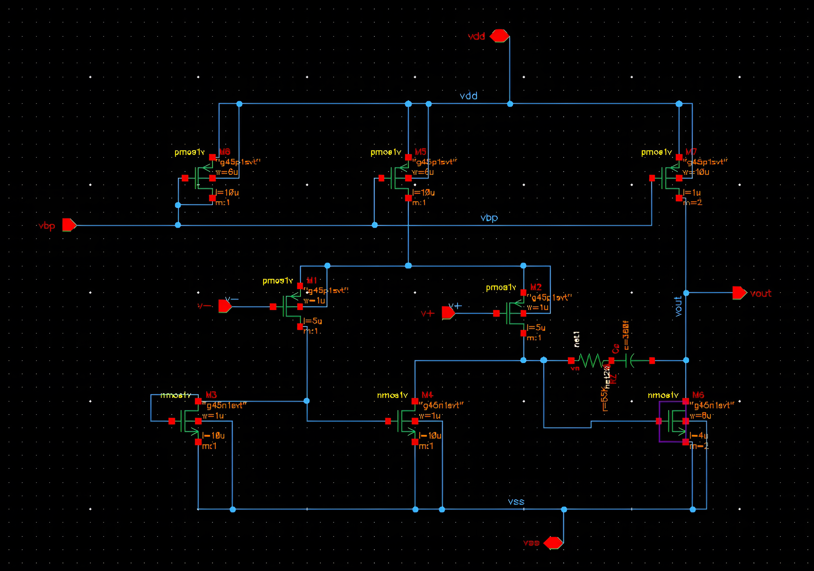
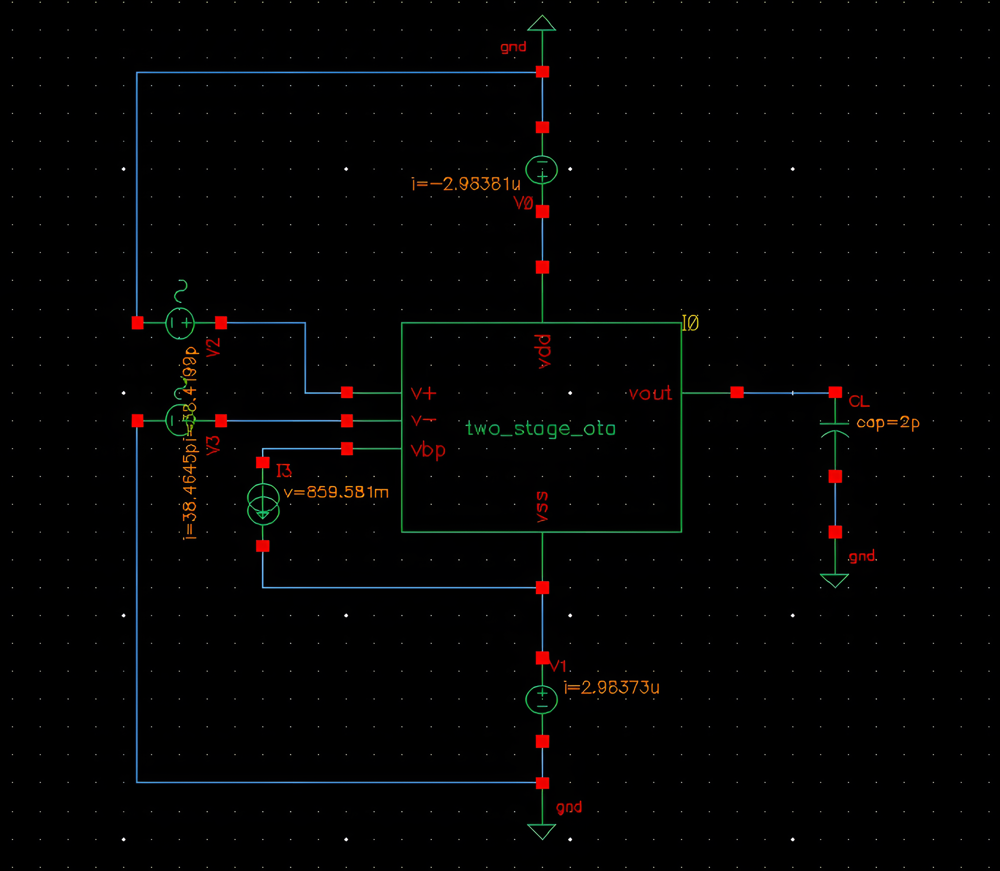
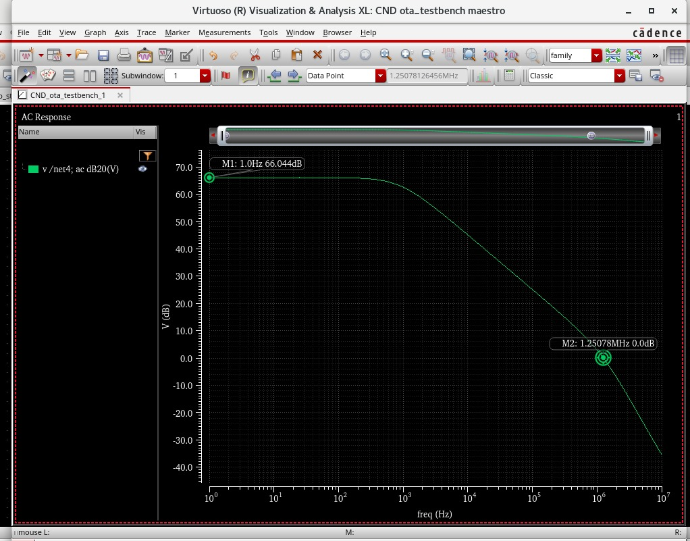
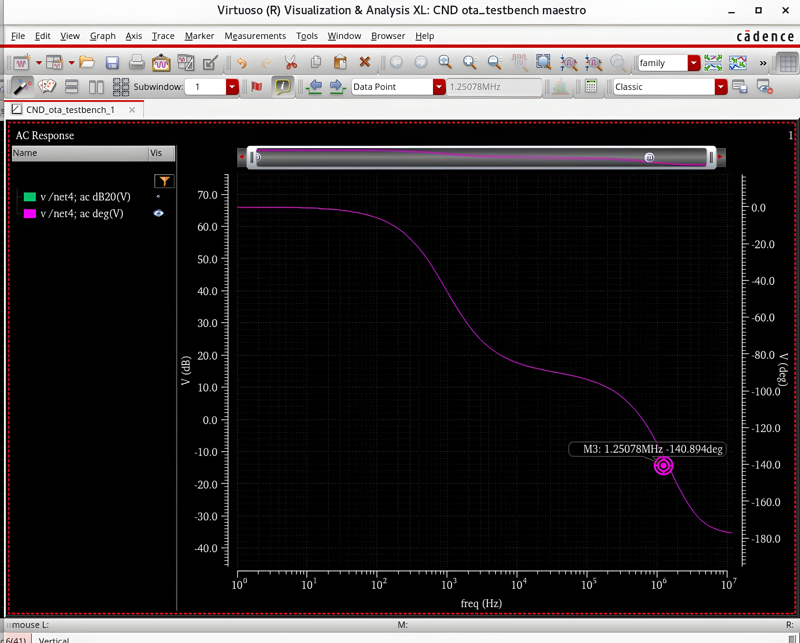
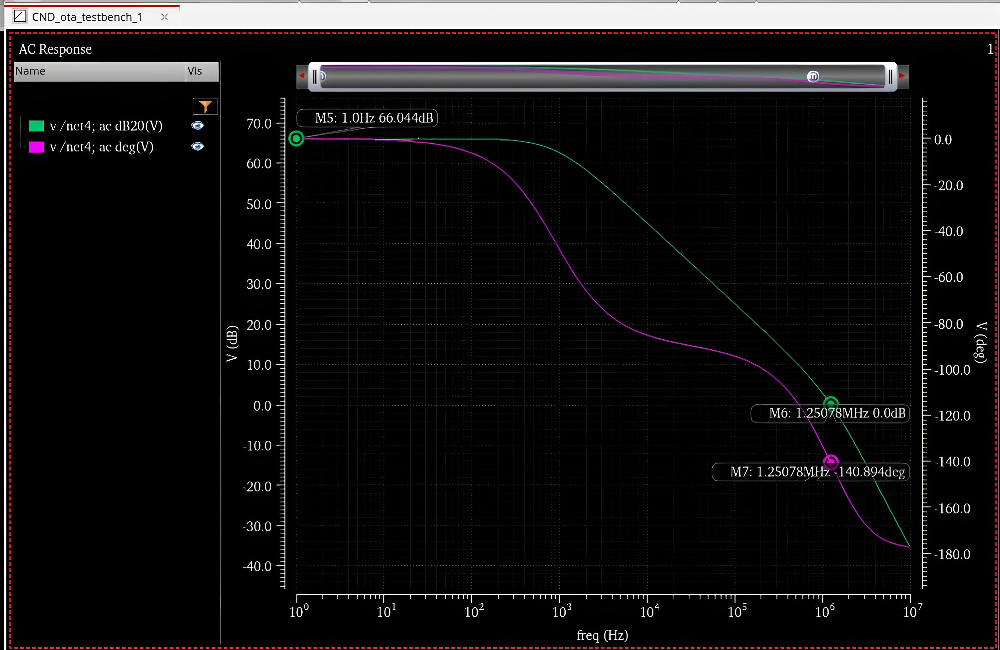

# Two-Stage Miller-Compensated OTA — gm/ID Design Methodology

Reproduction of a two-stage Miller-compensated OTA design from a peer-reviewed paper on ECG analog front-end circuits, implemented in Cadence Virtuoso using the gm/ID sizing methodology.

## Reference Paper
Emon, M.Z.A.; Salim, K.M.; Chowdhury, M.I.B. "Design and Analysis of a High-Gain, Low-Noise, and Low-Power Analog Front End for Electrocardiogram Acquisition in 45 nm Technology Using gm/ID Method." *Electronics* 2024, 13, 2190. https://doi.org/10.3390/electronics13112190

## Tools & Technology
- **Simulator:** Cadence Virtuoso (Spectre)
- **Process:** TSMC-equivalent 45nm technology
- **Methodology:** gm/ID sizing approach

## Design Specifications
| Parameter | Target |
|---|---|
| Supply Voltage | ±0.6 V |
| Bias Current | 200 nA |
| GBW | 1.25 MHz |
| Load Capacitance | 2 pF |

## Circuit Schematic

## Testbench

## Results — Comparison with Reference Paper

| Parameter | This Work | Reference Paper | Status |
|---|---|---|---|
| DC Gain | 66.0 dB | 64.5 dB | Better |
| Phase Margin | 40° | 34° | Better |
| GBW | 1.25 MHz | 1.24 MHz | Matches |
| CMRR | 70.2 dB | 66.5 dB | Better |
| Input-Referred Noise | 14.9 µV | 15.9 µV | Better |

### Gain Response

### Phase Response

### Combined Gain & Phase (Phase Margin)

## Notes
This project was undertaken as a hands-on learning exercise to understand analog IC design flow using the gm/ID methodology, following the CMOS Analog IC Design course (ITI). The design methodology and specifications are derived from the cited paper; all simulations and circuit sizing were independently performed in Cadence Virtuoso.
